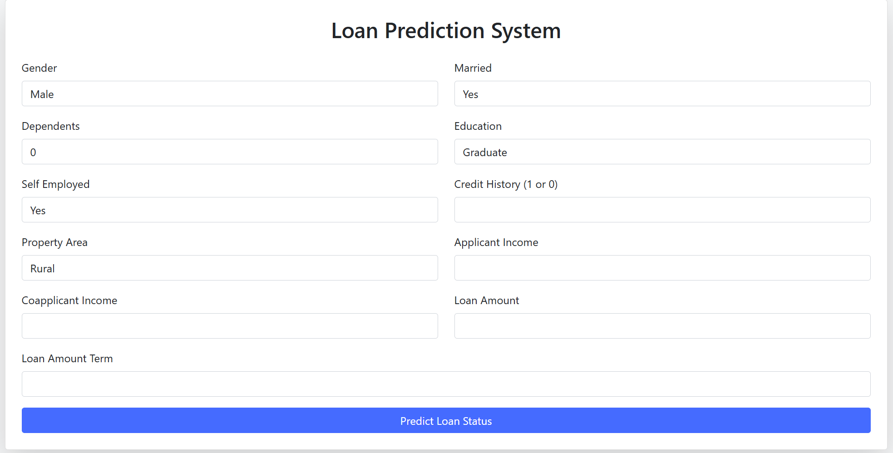

# 🏦 Loan Approval Prediction System




## 📌 Project Overview

The Loan Approval Prediction System is a Machine Learning web application that predicts whether a loan application will be approved or rejected based on applicant financial and demographic details.

This project combines:
- Data Preprocessing
- Model Training
- Model Comparison
- Model Deployment using Flask

The trained ML model is integrated into a Flask web app where users can input details and receive instant predictions.

---

## 🚀 Key Features

- Web-based loan approval prediction
- User-friendly input form
- Real-time prediction results
- Multiple ML models trained and compared
- Best model saved using `joblib`
- Clean Bootstrap-based UI

---

## 📊 Features Used for Prediction

- Gender
- Married Status
- Dependents
- Education
- Self Employed
- Applicant Income
- Coapplicant Income
- Loan Amount
- Loan Amount Term
- Credit History
- Property Area

---

## 🧠 Machine Learning Models Used

- Logistic Regression
- Support Vector Machine (SVM)
- Random Forest Classifier

The best performing model was selected based on test accuracy.

---

## 📈 Model Performance

| Model | Train Accuracy | Test Accuracy |
|------|---------------|--------------|
| Logistic Regression | 74.83% | 78.38% |
| Decision Tree | 82.05% | 82.70% |
| Random Forest | 82.75% | 84.32% |
| SVM | 85.31% | 78.91% |
| XGBoost | **80.65%** | **84.86%** |

**Best Model:** XGBoost achieved the highest test accuracy (84.86%) for loan approval prediction.
---

## 🛠️ Tech Stack

### Programming Language
- Python

### Libraries
- Pandas
- NumPy
- Scikit-learn
- Joblib

### Backend
- Flask

### Frontend
- HTML5
- Bootstrap 5

---

## ⚙️ Installation & Setup

###  Clone the Repository

```bash
git clone https://github.com/your-username/loan-prediction-app.git
cd loan-prediction-app
```
### Create Virtual Environment

 ```bash
 python -m venv venv
venv\Scripts\activate   # For Windows
```
### Install Required Packages
```bash
pip install -r requirements.txt
```
### Run the Flask Application
```bash
python app.py
```
### Open in Browser
```bash
http://127.0.0.1:3000
```
